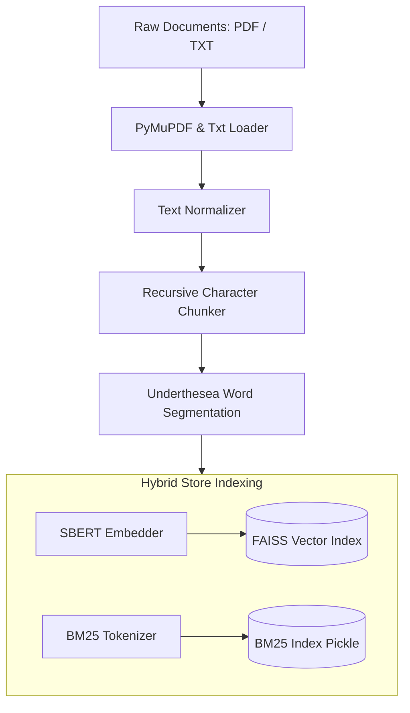
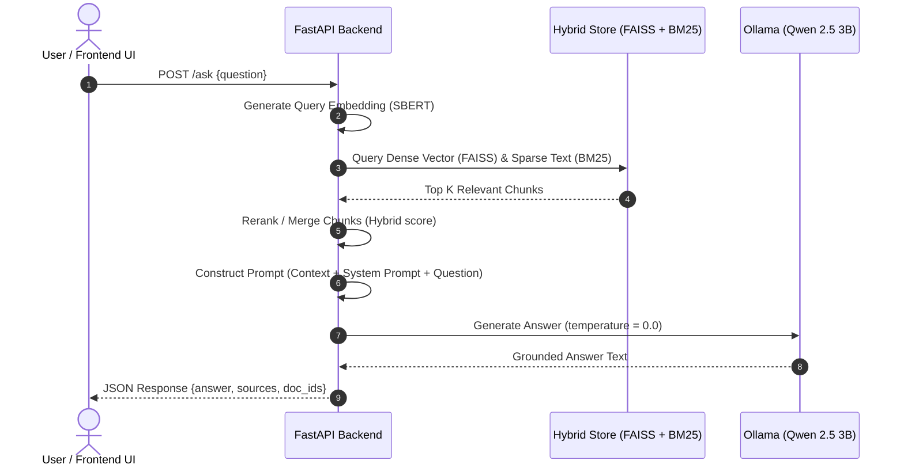

# 🤖 Vietnamese RAG Chatbot

[](https://www.python.org/)
[](https://fastapi.tiangolo.com/)
[](https://streamlit.io/)
[](https://ollama.com/)
[](https://opensource.org/licenses/MIT)

An enterprise-grade, local-first **Vietnamese Retrieval-Augmented Generation (RAG) Chatbot** system. This project implements a hybrid search approach (combining dense vector retrieval with sparse keyword matching) tailored specifically for the Vietnamese language, coupled with a local LLM to generate precise, grounded answers while preventing hallucinations.

---

## 📖 Introduction

Retrieval-Augmented Generation (RAG) is a technique that enhances Large Language Models (LLMs) by retrieving relevant documents from a local knowledge base to answer user queries. 

In Vietnamese document processing, challenges often arise due to word segmentation, compound words, and complex grammatical structures. This project addresses these challenges by:
1. Using **Underthesea** for accurate Vietnamese word segmentation and tokenization.
2. Embedding documents using **Vietnamese-SBERT** (`keepitreal/vietnamese-sbert`) for high-fidelity semantic representations.
3. Combining dense retrieval with **BM25** sparse keyword matching to ensure both semantic and keyword-based query alignment.
4. Employing local **Qwen 2.5 3B** via **Ollama** to ensure high-speed generation, low latency, and absolute data privacy.

---

## 🚀 Key Features

* **Hybrid Search Retrieval:** Merges dense vector embeddings (FAISS) with sparse keyword matching (BM25) using an adjustable blending factor ($\alpha$).
* **Local-First Architecture:** Keeps your documents private. All embeddings, vector index searches, and text generations run locally.
* **Vietnamese Text Optimization:** Custom preprocessing pipeline that normalizes text and segments Vietnamese words before indexing.
* **FastAPI Backend Services:** High-performance async API endpoints (`/ask` and `/ingest`) ready to be integrated with any production service.
* **Interactive Streamlit Web UI:** A beautiful, responsive chat interface featuring:
  - Full conversation history.
  - Collapsible document source attributions (showing filenames and chunk references).
  - Simulated real-time response streaming.
* **Robust Config Management:** 100% configurable via environment variables or a `.env` file (chunk size, overlap, temperature, models, top-k).

---

## 📐 Overall Architecture

The system is split into two primary pipelines: **Document Ingestion** (indexing) and **Retrieval & Question Answering** (runtime).

### 1. Document Ingestion Pipeline



### 2. Retrieval & Question Answering Flow



---

## ⚙️ Environment Configuration

The application can be configured by creating a `.env` file in the root directory. Below are the supported configuration parameters:

| Variable | Description | Default Value |
| :--- | :--- | :--- |
| `CHUNK_SIZE` | Maximum characters per chunk | `800` |
| `CHUNK_OVERLAP` | Character overlap between consecutive chunks | `120` |
| `EMBEDDING_MODEL`| HuggingFace model name for sentence embeddings | `keepitreal/vietnamese-sbert` |
| `VECTOR_STORE` | Vector database engine | `faiss` |
| `TOP_K` | Number of documents to retrieve | `5` |
| `LLM_MODEL` | LLM model tag registered in Ollama | `qwen2.5:3b` |
| `MAX_CONTEXT_CHUNKS`| Maximum chunks fed into the LLM context | `5` |
| `TEMPERATURE` | Temperature for LLM response generation | `0.0` (for maximum factuality) |

---

## 📦 Installation

### Prerequisites

1. **Python 3.10+**
2. **Ollama:** Download and install Ollama from [ollama.com](https://ollama.com/).
3. Pull the default LLM model:
   ```bash
   ollama pull qwen2.5:3b
   ```

### Setup Directory & Dependencies

We recommend using **`uv`** for lightning-fast package management, but standard `pip` works too.

#### Option A: Using `uv` (Recommended)
```bash
# Clone the repository
git clone https://github.com/lebaohungk05/Rag-vndoc.git
cd Rag-vndoc

# Synchronize virtualenv and dependencies
uv sync
```

#### Option B: Using standard `pip`
```bash
# Clone the repository
git clone https://github.com/lebaohungk05/Rag-vndoc.git
cd Rag-vndoc

# Create virtual environment
python -m venv .venv
source .venv/bin/activate  # On Windows: .venv\Scripts\activate

# Install dependencies
pip install -r requirements.txt
```

---

## 🏃 Running the Project

Follow these steps to ingest raw documents and launch the application.

### Step 1: Prepare Raw Documents
Place your knowledge base documents (`.pdf` or `.txt` format) inside the raw data folder:
```bash
data/raw/
```
*(For testing, some sample Vietnamese documents are already placed in `data/raw/`)*

### Step 2: Run Data Ingestion
Process, chunk, embed, and index your documents into the hybrid store:
```bash
# Using uv
uv run scripts/run_ingest.py

# Or using standard python
python scripts/run_ingest.py
```
This script generates the FAISS index and BM25 pickles inside the `artifacts/faiss_index/` directory.

### Step 3: Run the FastAPI Backend
Start the high-performance backend server:
```bash
# Run server via uvicorn
python main.py
```
The API documentation will be available at [http://localhost:8000/docs](http://localhost:8000/docs).

### Step 4: Run the Streamlit Frontend Web UI
In a separate terminal, launch the chat interface:
```bash
streamlit run app.py
```
Open your browser at [http://localhost:8501](http://localhost:8501) to begin chatting with your documents.

---

## 📁 Folder Structure

```text
Rag-vndoc/
├── .venv/                      # Python Virtual Environment
├── artifacts/                  # Generated indexing assets
│   └── faiss_index/            # FAISS index, BM25 pickle, and saved chunks
├── data/
│   ├── processed/              # Intermediary processed chunk data
│   └── raw/                    # Raw input documents (.pdf, .txt)
├── scripts/
│   ├── run_ask.py              # CLI tool to test queries sequentially
│   └── run_ingest.py           # CLI tool to run the ingestion pipeline
├── src/
│   └── rag_chatbot/
│       ├── chunkers/           # Document chunking algorithms
│       ├── embedders/          # Dense vector embedding wrappers
│       ├── loaders/            # PDF and TXT document loaders
│       ├── models/             # Local LLM connector (Ollama)
│       ├── pipeline/           # Ingest & Ask pipeline orchestrators
│       ├── preprocess/         # Text normalization and cleaners
│       ├── prompts/            # System & User RAG Prompts
│       ├── stores/             # FAISS and Hybrid vector store engines
│       ├── config.py           # Application Settings and Environment loader
│       └── protocols.py        # Abstract interfaces for components
├── app.py                      # Streamlit Frontend UI
├── main.py                     # FastAPI Backend Server entrypoint
├── pyproject.toml              # Project dependencies and metadata configuration
├── requirements.txt            # Dependency file (for pip)
├── val (1).json                # Validation dataset for system evaluation
└── README.md                   # This file
```

---

## 🗺️ Roadmap

- [ ] **Parallel Evaluation Suite:** Write a multi-threaded evaluation script using `concurrent.futures` to test system output quality against `val (1).json` using ROUGE/BLEU scores.
- [ ] **Retrieval Re-ranking:** Integrate a Cross-Encoder model (e.g. Cohere or local HuggingFace re-ranker) to re-rank the hybrid retrieval outputs before sending to the LLM.
- [ ] **Document Metadata Filtering:** Support filtering retrieved contexts by document source, date, or category tags.
- [ ] **Direct File Upload in UI:** Allow users to upload files dynamically in the Streamlit Sidebar to ingest documents without running console commands.
- [ ] **Async Streaming Response:** Convert the REST API endpoints to FastAPI Server-Sent Events (SSE) for true token-by-token streaming in the UI.

---

## 🤝 Contribution Guidelines

We welcome contributions to improve this RAG system! To contribute:

1. **Fork** the repository on GitHub.
2. Create a new branch for your feature/bugfix:
   ```bash
   git checkout -b feature/amazing-feature
   ```
3. Write clean, readable code with explicit type annotations where possible.
4. Open a **Pull Request** detailing your changes.

---

## 📄 License

Distributed under the **MIT License**. See `LICENSE` for more information.

---

*Developed by Le Bao Hung
